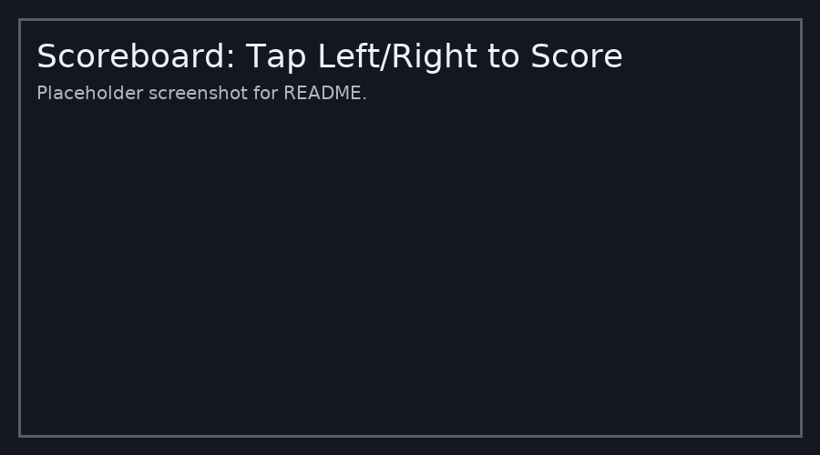
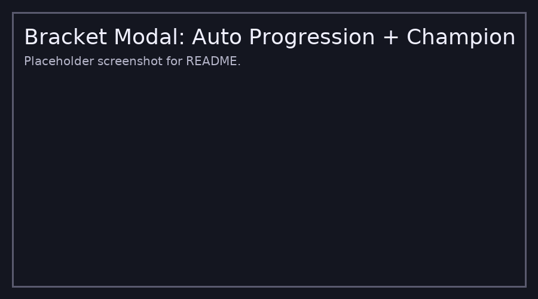

# VolleyBoard Live+ (GitHub Pages + PWA)

A volleyball scoreboard for **Indoor** (Bo5, final set to 15) and **Beach** (Bo3, final set to 15).  
Tap left/right halves to award points. Two timeouts per set per side.  
**Timed matches:** countdown from a user-entered duration, hide timeouts in last 5:00.  
**Untimed matches:** timer hidden.  
**Between sets:** automatic 2:00 break screen.  
Installable PWA, works offline, supports **Live viewing** via Firebase (optional).

## Features
- Full-screen scoreboard (left/right tap to score)
- Indoor/Beach modes with correct set logic
- 2 timeouts per set, full-screen timeout window (30s)
- Timed/Untimed matches (timer center, MM:SS)
- 2-minute automatic between-set window
- History, coin toss, team logos/colors, optional indoor rotations
- Tournament Bracket (4/8/16) with auto-advance + Champion
- PWA offline support (install to home screen)
- **Live viewing (optional)** via Firebase link + QR

---

## 1) Deploy on GitHub Pages
1. Create a new repository.  
2. Upload all files from this zip to the repo root.  
3. In repo settings → **Pages** → Source: **Deploy from a branch**, Branch: **main** (root).  
4. Wait for Pages to publish, then open your site link.

> Tip: as a PWA, your phone will offer “Install App / Add to Home Screen”.

---

## 2) Configure Firebase (for Live viewing – optional)
This enables “Go Live” (controller) and “Join as Viewer” (read-only) over the internet.

### A) Create a Firebase project
1. Go to https://console.firebase.google.com  
2. Add project → choose a name → continue (enable/skip analytics as you prefer).

### B) Add a web app
1. In your new project, click **Web** (</>) to register a web app.  
2. Copy the config object (it looks like `apiKey`, `authDomain`, etc.).

### C) Enable Firestore
1. In the left sidebar → **Build → Firestore Database**.  
2. Click **Create database** → Choose **Start in test mode** for quick testing.  
3. Choose a location → **Enable**.

### D) Paste config into `firebase-config.js`
Open `firebase-config.js` and paste your values:
```js
window.FB_CFG = {
  apiKey: "YOUR_API_KEY",
  authDomain: "YOUR_PROJECT.firebaseapp.com",
  projectId: "YOUR_PROJECT_ID",
  storageBucket: "YOUR_PROJECT.appspot.com",
  messagingSenderId: "YOUR_SENDER_ID",
  appId: "YOUR_APP_ID"
};
```

### E) (Optional) Firestore security rules
For testing, “test mode” is fine. For production, restrict writes so only the controller updates the `state` document fields you need. (I can provide hardened rules if you want.)

### F) Use it
- On **Home** → **📡 Go Live** → **Create Live Room** to get a **share link** and **QR code**.  
- Viewers open the link; they’ll see a read-only scoreboard that updates live.  
- You (controller) keep the scoreboard page open while running the match.

> If Firebase isn’t configured yet, the Live modal shows a warning but the rest of the app still works offline.

---

## 3) Screenshots

**Home Screen**  


**Live Share Modal**  


**Scoreboard**  


**Bracket Modal**  


---

## 4) Development Notes
- Installable PWA with `manifest.webmanifest` and `service-worker.js` (cache: `vb-fs-v1`).  
- All secondary UI (Live, Bracket, History, Final) are **fullscreen windows** with a close button.  
- No MVP voting and no timeout advisers, per your requirements.

Enjoy! 🏐
